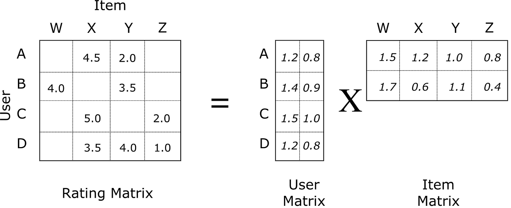

# Introduction
Spotify is the worlds largest audio streaming platform. The goal is to create a
recommendation model that generate songs for playlists.

## What is ALS

The goal is to iteratively adjust the user matrix and item matrix to reduce the loss function for the rating matrix.

## Data
The data used is the spotify million data set found on [kaggle](https://www.kaggle.com/datasets/himanshuwagh/spotify-million). The data format is structured non-relational data, split across multiple files in groups of 1000 playlists. Each entry is filled with meta data and song data.

Also extracted data directly from spotify, made a custom mapping for the uri so that new data could be added seemlessly.

# Outcomes
1. Cleaned and transformed the dataset from kaggle.
2. Trained an ALS machine learning model to recommend songs based on that data
3. Extracted and Formated playlists from Spotify's API
4. Rolled the entries into the existing model (no retraining) and generated recommendations for users

# Challenges and Limitations
ALS machine learning models often suffer from popularity bias. This machine learning model is no different. Further optimizations are necessary to create a more general recommendation model.

The reason the model suffers from popularity bias is because of the way that ALS weights are calculated. You iteratively update the weights to match the actual ratings and fill in the unknown ratings in the process. Popular songs will influence unknown ratings to be filled with higher values, thus being more likely to recommend the popular songs.

My attempts to reduce this was by decreasing the rating of very popular songs, however this was not very impactful.

Alternative solutions to this problem involve identifying unpopular or more niche recommendations and adding them into the recommendation pool. Generally, some sort of rating system to artificially boost unpopular recommendations and boost popular recommendations.

# About Distributed Analysis
Visualization was substituted with stats due to the limitations of visualizing large data sets. Samples would be random, thus not particularly accurate without doing more statistical tests. Stats were more indicative of the real areas to look at and evaluate in a more timely and concise manner.
